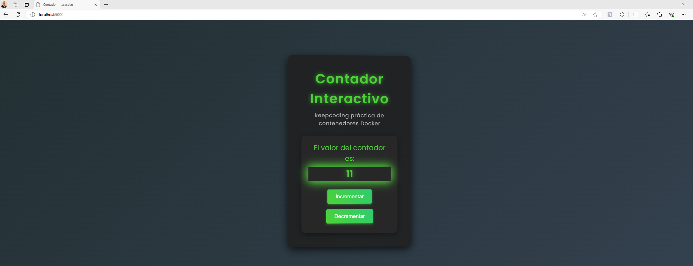
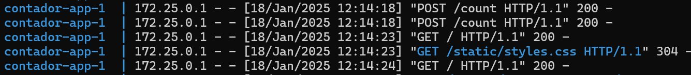
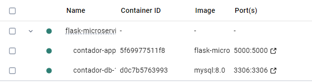
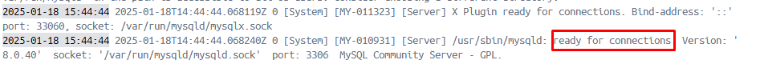
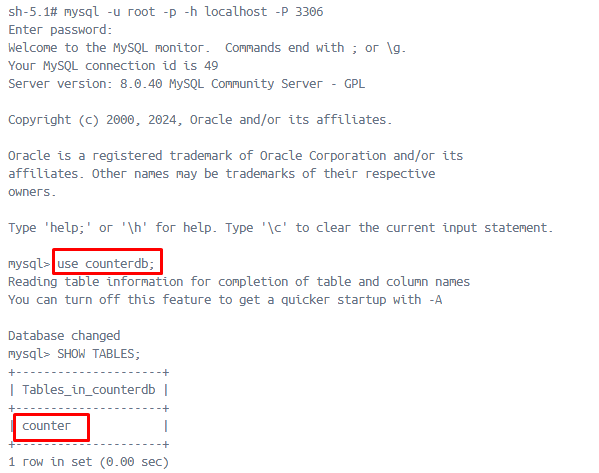

# Práctica final del módulo de Docker- Ramón Meza
Implementación de una Aplicación como Microservicio con Contenedores

## Indice de la documentación
1. [Introducción](#introducción)
   - Descripción del Proyecto
   - Funcionalidades
   - Requisitos
   - Estructura
2. [Arquitectura](#arquitectura)
   - Componentes del Proyecto
   - Diagrama de Arquitectura
3. [Pasos para Configurar y Ejecutar la Aplicación](#pasos-para-configurar-y-ejecutar-la-aplicación)
   
4. [Detalles de la Implementación](#detalles-de-la-implementación)
   - Lógica de la Aplicación en Flask (app.py)
   - Construcción de la Imagen Docker para Flask (Dockerfile)
   - Configuración de los Contenedores y Servicios (docker-compose.yml)
   - Comprobar la conexión de la MySQL y verificar si la base de datos (`counterdb`) está disponible
   

## Introducción

### Descripción del Proyecto

Este proyecto es una aplicación web que permite incrementar o decrementar un contador almacenado en una base de datos MySQL. La aplicación está contenedorizada con Docker, lo que permite un fácil despliegue y gestión. El frontend está construido con HTML, CSS y JavaScript, mientras que Flask se encarga del backend. La base de datos MySQL se ejecuta en un contenedor separado y está gestionada por Docker Compose.

## Funcionalidades
- **Interfaz de usuario interactiva** que muestra el valor actual del contador.
- **Botones para incrementar y decrementar** el valor del contador.
- **API RESTful** para actualizar el contador en la base de datos MySQL.

## Requisitos
### Dependencias de Python:
- **Flask**
- **mysql-connector-python**
- **python-dotenv**
### Requisitos del Sistema:
- **Docker**: Asegúrate de tener Docker instalado en tu sistema.
- **Docker Compose**: Debes tener Docker Compose para gestionar múltiples contenedores de manera eficiente.
  
## Estructura
```bash
flask-microservice/
│
├── app.py               # Código principal de la aplicación Flask
├── Dockerfile           # Instrucciones para construir la imagen de Docker
├── docker-compose.yml   # Configuración para ejecutar varios contenedores Docker
├── config.py            # Configuraciones de la aplicación Flask
├── templates/
│   └── count.html       # Plantilla HTML
├── static/
│   └── styles.css       # Estilos CSS
├── init.sql
└── .env                 # Variables de entorno
```
## Arquitectura
### Componentes del Proyecto
1. **Flask**: Framework de Python utilizado para crear la aplicación web.
2. **MySQL**: Base de datos relacional que almacena el valor del contador.
3. **Docker y Docker Compose**: Herramientas utilizadas para crear y gestionar contenedores para la aplicación y la base de datos.
### Diagrama de Arquitectura
- **Contenedor Flask**: Ejecuta la aplicación que interactúa con los usuarios a través de una interfaz web.
- **Contenedor MySQL**: Almacena el valor del contador en una base de datos MySQL.
- **Docker Compose**: Gestiona ambos contenedores (Flask y MySQL) y los conecta a través de una red compartida.

## Pasos para configurar y ejecutar la aplicación

### 1. Crear el archivo `app.py`
Contiene la lógica principal de la aplicación Flask, incluidas las rutas para mostrar y actualizar el contador.
```bash
import os
import mysql.connector
from flask import Flask, request, jsonify, render_template
from config import Config

app = Flask(__name__)
app.config.from_object(Config)

# Función para obtener una conexión a la base de datos
def get_db_connection():
    conn = mysql.connector.connect(
        host=app.config['DB_HOST'],
        port=app.config['DB_PORT'],
        user=app.config['DB_USER'],
        password=app.config['DB_PASSWORD'],
        database=app.config['DB_NAME']
    )
    return conn

@app.route('/', methods=['GET'])
def home():
    try:
        # Obtener el valor del contador desde la base de datos
        conn = get_db_connection()
        cursor = conn.cursor(dictionary=True)
        cursor.execute('SELECT count_value FROM counter WHERE id = 1')
        result = cursor.fetchone()
        conn.close()

        # Si no se encuentra el valor, maneja el caso
        if result is None:
            return jsonify({"error": "No se encontró el contador en la base de datos"}), 404

        # Renderizar la página HTML con el valor actual del contador
        return render_template('count.html', count=result['count_value'])
    except Exception as e:
        # Si ocurre un error, devuelve un mensaje de error
        return jsonify({"error": str(e)}), 500

    # Verificar si el resultado es None, en caso de que no haya un valor en la base de datos
    if result is None:
        count_value = 0  # Asignar un valor inicial en caso de no encontrar un registro
    else:
        count_value = result['count_value']

    # Renderizar la página HTML con el valor actual del contador
    return render_template('index.html', count=count_value)

@app.route('/count', methods=['POST'])
def update_count():
    # Obtener el nuevo valor del contador desde la solicitud JSON
    new_count = request.json.get('count')

    # Actualizar el valor en la base de datos
    conn = get_db_connection()
    cursor = conn.cursor()
    cursor.execute('UPDATE counter SET count_value = %s WHERE id = 1', (new_count,))
    conn.commit()
    conn.close()

    return jsonify({"message": "Count updated successfully"})


if __name__ == '__main__':
    app.run(host='0.0.0.0', port=5000, debug=False)
```
### 2. Crear el archivo `Dockerfile`
Define cómo construir la imagen Docker para la aplicación Flask, instalando las dependencias necesarias y exponiendo el puerto 5000.
```bash
# Utiliza una imagen base de Python 3.9 slim
FROM python:3.9-slim

# Establece el directorio de trabajo
WORKDIR /app

# Copia los archivos de la aplicación al contenedor
COPY . .

# Instalar las dependencias
RUN pip install --upgrade pip
RUN pip install --no-cache-dir -r requirements.txt

# Expone el puerto para Flask
EXPOSE 5000

# Comando para ejecutar la aplicación
CMD ["python", "app.py"]

```
### 3. Crear el archivo `docker-compose.yml`
Define los servicios Docker para la aplicación Flask y MySQL. Gestiona la red y las variables de entorno para la conexión entre ambos servicios.
```bash
version: '3.8'

services:
  contador-app:
    build: .
    ports:
      - "5000:5000"
    environment:
      - DB_HOST=contador-db
      - DB_PORT=3306
      - DB_USER=root
      - DB_PASSWORD=rootpassword
      - DB_NAME=counterdb
    depends_on:
      - contador-db
    networks:
      - app-network
    volumes:
      - .:/app

  contador-db:
    image: mysql:8.0
    environment:
      MYSQL_ROOT_PASSWORD: rootpassword
      MYSQL_DATABASE: counterdb
    ports:
      - "3306:3306"
    networks:
      - app-network
    volumes:
      - db-data:/var/lib/mysql
      - ./init.sql:/docker-entrypoint-initdb.d/init.sql  # Montar el archivo init.sql

    healthcheck:
      test: ["CMD", "mysqladmin", "ping", "-h", "localhost"]
      interval: 10s
      retries: 5
      timeout: 5s

networks:
  app-network:
    driver: bridge

volumes:
  db-data:

```
### 4. Crear el archivo `.env`
El archivo `.env` contiene las variables de entorno necesarias para conectar la aplicación Flask con la base de datos MySQL.

### 5. Crear el archivo `config.py`
Contiene la configuración de la base de datos, utilizando las variables de entorno para las credenciales.

### 6. Crear el archivo `count.html`
Plantilla HTML que muestra el contador y permite interactuar con él.

### 7. Crear el archivo `styles.css`
Define el estilo visual de la interfaz, proporcionando una experiencia de usuario atractiva y moderna.

## 2. Construcción de los contenedores Docker
Para construir los contenedores Docker que ejecutarán la aplicación Flask y la base de datos MySQL, utiliza el siguiente comando de Docker Compose:
```bash
docker-compose up --build
```
## 3. Acceder a la aplicación
Una vez que los contenedores se hayan construido y estén en ejecución, podrás acceder a la aplicación web desde tu navegador utilizando la siguiente URL:
```bash
http://localhost:5000

```
### 4. Interfaz de usuario
Muestra el contador actual y proporciona botones para interactuar con él. Usa JavaScript para enviar las actualizaciones del contador a la ruta `/count` y actualizar el valor mostrado en la página.




## 5. Detener los contenedores
Cuando hayas terminado de trabajar con la aplicación, puedes detener los contenedores utilizando el siguiente comando:
```bash
docker-compose down

```
Este comando detiene y elimina los contenedores en ejecución, pero conserva los volúmenes de datos para que no se pierdan.

## Detalles de la implementación
### 1. Lógica de la Aplicación en Flask (`app.py`)

- **Ruta `/` (GET)**: Renderiza la página con el contador actual, obteniendo el valor desde la base de datos MySQL.
- **Ruta `/count` (POST)**: Recibe una solicitud JSON con el nuevo valor del contador y lo actualiza en la base de datos MySQL.
  
  

### 2. Construcción de la imagen Docker para Flask (`Dockerfile`)

- Usa una imagen base de Python 3.9 slim.
- Instala las dependencias definidas en `requirements.txt`.
- Expone el puerto 5000 para que Flask pueda servir la aplicación web.

### 3. Configuración de los contenedores y servicios (`docker-compose.yml`)
Este archivo gestiona dos servicios:
- **contador-app**: Contenedor que ejecuta la aplicación Flask.
- **contador-db**: Contenedor que ejecuta MySQL. La base de datos y la aplicación Flask se conectan a través de una red compartida, y las variables de entorno definen las credenciales de la base de datos.

  

### 4. Comprobar la conexión de la MySQL y verificar si la base de datos (`counterdb`) está disponible
Se comprueba si la MySQL ha iniciado correctamente a través de los logs, para luego acceder utilizando las credenciales definidas. Una vez establecida la conexión, se comprueba si la base de datos (`counterdb`) aparece en la lista de bases de datos disponibles, lo que confirma su existencia.  






  


